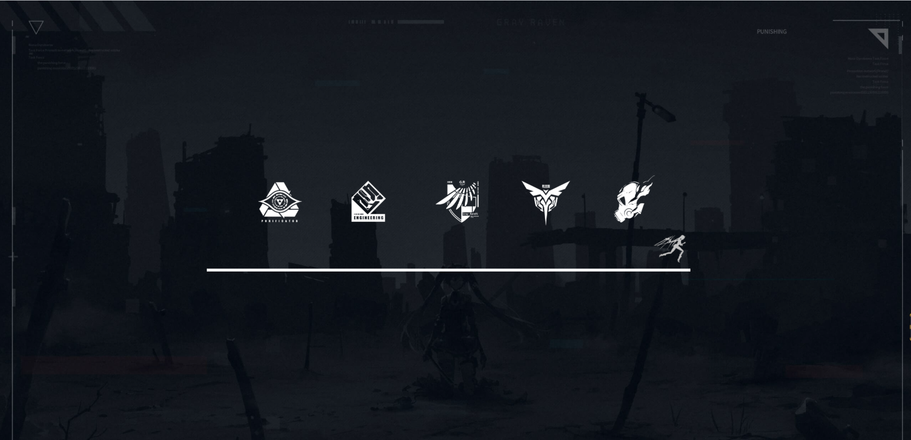
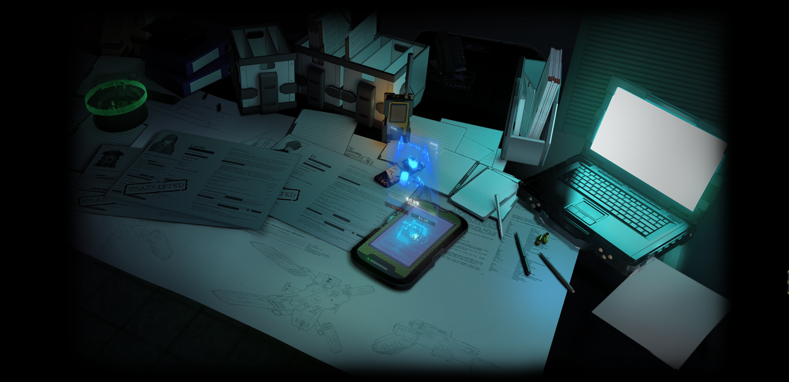

# pixijs-loading

## 基于pixijs实现的loading效果

- 场景一

- 场景二

## 预览地址

<a href="https://coffeehouse1122.github.io/pixijs-loading/" target="_blank">https://coffeehouse1122.github.io/pixijs-loading/</a>

## 项目依赖

- pixi
- pixi-particles
- scaleToWindow
- TweenMax
- jquery

## 素材来源

- 《战双帕弥什》游戏

